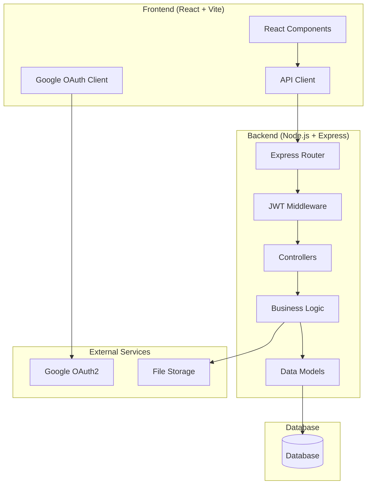

# Design Document

## Overview

KaviosPix is a full-stack image management system built with a Node.js/Express backend API and React frontend. The system uses Google OAuth2 for authentication, JWT for session management, and provides comprehensive image and album management capabilities. The architecture follows RESTful API principles with secure file handling and metadata management.

## Architecture

### System Architecture



### Technology Stack

**Frontend:**

- React 19 with TypeScript
- Vite for build tooling
- Axios for HTTP requests
- React Router for navigation
- Google OAuth2 client library

**Backend:**

- Node.js with Express.js
- JavaScript (CommonJS modules)
- JWT for authentication
- Multer for file uploads
- Google OAuth2 server library (passport-google-oauth20)
- Mongoose for MongoDB ODM

**Database:**

- MongoDB for document-based data storage
- File system or cloud storage (AWS S3) for images

**Authentication:**

- Google OAuth2 for user authentication
- JWT tokens for API authorization

## Components and Interfaces

### Backend API Structure

```
server/
├── controllers/
│   ├── authController.js
│   ├── albumController.js
│   └── imageController.js
├── middleware/
│   ├── authMiddleware.js
│   ├── uploadMiddleware.js
│   └── validationMiddleware.js
├── models/
│   ├── User.js (existing)
│   ├── Album.js (existing)
│   └── Image.js (existing)
├── services/
│   ├── authService.js
│   ├── albumService.js
│   └── imageService.js
├── routes/
│   ├── auth.js
│   ├── albums.js
│   └── images.js
├── config/
│   └── db.js (existing)
├── utils/
│   ├── fileUtils.js
│   ├── jwtUtils.js
│   └── validators.js
├── uploads/ (for image storage)
├── package.json (existing)
└── server.js (main entry point)
```

### Frontend Component Structure

```
src/
├── components/
│   ├── auth/
│   │   ├── LoginButton.tsx
│   │   └── AuthCallback.tsx
│   ├── albums/
│   │   ├── AlbumList.tsx
│   │   ├── AlbumCard.tsx
│   │   ├── CreateAlbum.tsx
│   │   └── ShareAlbum.tsx
│   ├── images/
│   │   ├── ImageGrid.tsx
│   │   ├── ImageCard.tsx
│   │   ├── ImageUpload.tsx
│   │   ├── ImageViewer.tsx
│   │   └── ImageMetadata.tsx
│   └── common/
│       ├── Header.tsx
│       ├── Navigation.tsx
│       └── LoadingSpinner.tsx
├── services/
│   ├── authService.ts
│   ├── albumService.ts
│   └── imageService.ts
├── hooks/
│   ├── useAuth.ts
│   ├── useAlbums.ts
│   └── useImages.ts
├── types/
│   ├── auth.ts
│   ├── album.ts
│   └── image.ts
└── utils/
    ├── apiClient.ts
    └── constants.ts
```

### API Endpoints Design

**Authentication Endpoints:**

- `GET /auth/google` - Initiate Google OAuth
- `GET /auth/google/callback` - Handle OAuth callback
- `POST /auth/logout` - Logout user
- `GET /auth/me` - Get current user info

**Album Endpoints:**

- `GET /api/albums` - Get user's albums
- `POST /api/albums` - Create new album
- `PUT /api/albums/:albumId` - Update album
- `DELETE /api/albums/:albumId` - Delete album
- `POST /api/albums/:albumId/share` - Share album

**Image Endpoints:**

- `GET /api/albums/:albumId/images` - Get album images
- `GET /api/albums/:albumId/images/favorites` - Get favorite images
- `GET /api/albums/:albumId/images?tags=tag1,tag2` - Search by tags
- `POST /api/albums/:albumId/images` - Upload image
- `PUT /api/albums/:albumId/images/:imageId/favorite` - Toggle favorite
- `POST /api/albums/:albumId/images/:imageId/comments` - Add comment
- `DELETE /api/albums/:albumId/images/:imageId` - Delete image

## Data Models

### User Model

```typescript
interface User {
  userId: string; // UUID
  email: string; // From Google OAuth
  name?: string; // From Google OAuth
  profilePicture?: string; // From Google OAuth
  createdAt: Date;
  updatedAt: Date;
}
```

### Album Model

```typescript
interface Album {
  albumId: string; // UUID
  name: string;
  description?: string;
  ownerId: string; // Reference to User
  sharedWith: string[]; // Array of user emails
  createdAt: Date;
  updatedAt: Date;
  imageCount: number; // Computed field
}
```

### Image Model

```typescript
interface Image {
  imageId: string; // UUID
  albumId: string; // Reference to Album
  name: string; // Original filename
  filename: string; // Stored filename
  path: string; // File path
  size: number; // File size in bytes
  mimeType: string; // Image MIME type
  tags: string[]; // Array of tags
  person?: string; // Person name if tagged
  isFavorite: boolean; // Favorite status
  comments: Comment[]; // Array of comments
  uploadedAt: Date;
  updatedAt: Date;
}

interface Comment {
  commentId: string; // UUID
  userId: string; // User who made comment
  text: string; // Comment text
  createdAt: Date;
}
```

### MongoDB Schema Design

**User Schema (Enhanced from existing):**

```javascript
const mongoose = require("mongoose");

const userSchema = new mongoose.Schema(
  {
    userId: {
      type: String,
      default: () => new mongoose.Types.ObjectId().toString(),
      unique: true,
      required: true,
    },
    email: {
      type: String,
      required: true,
      unique: true,
    },
    name: String,
    profilePicture: String,
  },
  {
    timestamps: true, // Adds createdAt and updatedAt
  }
);

module.exports = mongoose.model("User", userSchema);
```

**Album Schema (Updated from existing):**

```javascript
const mongoose = require("mongoose");

const albumSchema = new mongoose.Schema(
  {
    albumId: {
      type: String,
      default: () => new mongoose.Types.ObjectId().toString(),
      unique: true,
      required: true,
    },
    name: {
      type: String,
      required: true,
    },
    description: String,
    owner: {
      type: mongoose.Schema.Types.ObjectId,
      ref: "User",
      required: true,
    },
    sharedWith: [
      {
        type: String, // Array of user emails (changed from ObjectId)
      },
    ],
  },
  {
    timestamps: true,
  }
);

// Virtual field for image count
albumSchema.virtual("imageCount", {
  ref: "Image",
  localField: "_id",
  foreignField: "album",
  count: true,
});

module.exports = mongoose.model("Album", albumSchema);
```

**Image Schema (Enhanced from existing):**

```javascript
const mongoose = require("mongoose");

const commentSchema = new mongoose.Schema(
  {
    commentId: {
      type: String,
      default: () => new mongoose.Types.ObjectId().toString(),
    },
    userId: {
      type: mongoose.Schema.Types.ObjectId,
      required: true,
      ref: "User",
    },
    text: {
      type: String,
      required: true,
    },
  },
  {
    timestamps: { createdAt: true, updatedAt: false },
  }
);

const imageSchema = new mongoose.Schema(
  {
    imageId: {
      type: String,
      default: () => new mongoose.Types.ObjectId().toString(),
      unique: true,
      required: true,
    },
    name: {
      type: String,
      required: true,
    },
    filename: {
      type: String,
      required: true, // New field to add
    },
    path: {
      type: String,
      required: true, // New field to add
    },
    size: {
      type: Number,
    },
    mimeType: {
      type: String,
      required: true, // New field to add
    },
    tags: [
      {
        type: String,
      },
    ],
    person: String,
    isFavorite: {
      type: Boolean,
      default: false,
    },
    comments: [commentSchema], // Enhanced from simple string array
    uploadedAt: {
      type: Date,
      default: Date.now,
    },
    album: {
      type: mongoose.Schema.Types.ObjectId,
      ref: "Album",
      required: true,
    },
    uploadedBy: {
      type: mongoose.Schema.Types.ObjectId,
      ref: "User",
      required: true,
    },
  },
  {
    timestamps: { createdAt: false, updatedAt: true },
  }
);

module.exports = mongoose.model("Image", imageSchema);
```

## Error Handling

### Error Response Format

```typescript
interface ErrorResponse {
  error: {
    code: string;
    message: string;
    details?: any;
  };
  timestamp: string;
  path: string;
}
```

### Error Categories

**Authentication Errors (401):**

- Invalid or expired JWT token
- Google OAuth authentication failure
- Missing authorization header

**Authorization Errors (403):**

- User doesn't own the album
- User doesn't have access to shared album
- Insufficient permissions for operation

**Validation Errors (400):**

- Invalid file type (not an image)
- File size exceeds limit (5MB)
- Missing required fields
- Invalid email format

**Not Found Errors (404):**

- Album not found
- Image not found
- User not found

**Server Errors (500):**

- Database connection issues
- File system errors
- External service failures

### Error Handling Middleware

```typescript
// Global error handler
const errorHandler = (
  err: Error,
  req: Request,
  res: Response,
  next: NextFunction
) => {
  const errorResponse: ErrorResponse = {
    error: {
      code: err.name || "INTERNAL_ERROR",
      message: err.message || "An unexpected error occurred",
    },
    timestamp: new Date().toISOString(),
    path: req.path,
  };

  // Log error for debugging
  console.error("Error:", err);

  // Send appropriate status code
  const statusCode = getStatusCode(err);
  res.status(statusCode).json(errorResponse);
};
```

## Testing Strategy

### Backend Testing

**Unit Tests:**

- Service layer functions
- Utility functions
- Validation logic
- JWT token handling

**Integration Tests:**

- API endpoint testing
- Database operations
- File upload functionality
- Authentication flow

**Test Structure:**

```
tests/
├── unit/
│   ├── services/
│   ├── utils/
│   └── middleware/
├── integration/
│   ├── auth.test.ts
│   ├── albums.test.ts
│   └── images.test.ts
└── fixtures/
    ├── testImages/
    └── mockData.ts
```

### Frontend Testing

**Component Tests:**

- React component rendering
- User interaction handling
- Props validation
- State management

**Integration Tests:**

- API service integration
- Authentication flow
- File upload process
- Navigation and routing

**E2E Tests:**

- Complete user workflows
- Cross-browser compatibility
- Mobile responsiveness

### Testing Tools

**Backend:**

- Jest for unit and integration tests
- Supertest for API testing
- MongoDB Memory Server for testing
- Mongoose test utilities

**Frontend:**

- React Testing Library
- Jest for unit tests
- Cypress for E2E testing

## Security Considerations

### Authentication Security

- Google OAuth2 with PKCE flow
- JWT tokens with short expiration (15 minutes)
- Refresh token rotation
- Secure HTTP-only cookies for token storage

### File Upload Security

- File type validation using MIME type checking
- File size limits (5MB maximum)
- Filename sanitization
- Virus scanning (future enhancement)
- Secure file storage with access controls

### API Security

- CORS configuration for frontend domain
- Rate limiting on API endpoints
- Input validation and sanitization
- SQL injection prevention through ORM
- XSS protection headers

### Data Privacy

- User data encryption at rest
- Secure file storage
- Access logging for audit trails
- GDPR compliance considerations

## Performance Considerations

### Image Optimization

- Image compression on upload
- Multiple image sizes (thumbnails, medium, full)
- Lazy loading for image grids
- CDN integration for image delivery

### Database Optimization

- Proper indexing on frequently queried fields
- Connection pooling
- Query optimization
- Pagination for large result sets

### Caching Strategy

- Redis for session storage
- Image metadata caching
- API response caching for read-heavy operations

### Frontend Performance

- Code splitting and lazy loading
- Image lazy loading
- Virtual scrolling for large image lists
- Service worker for offline capabilities
